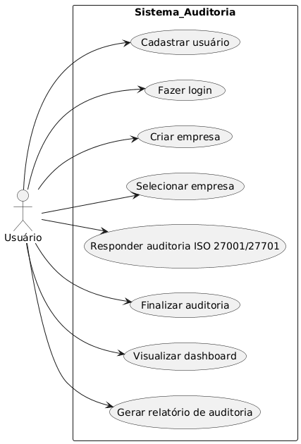
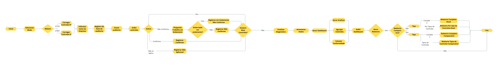
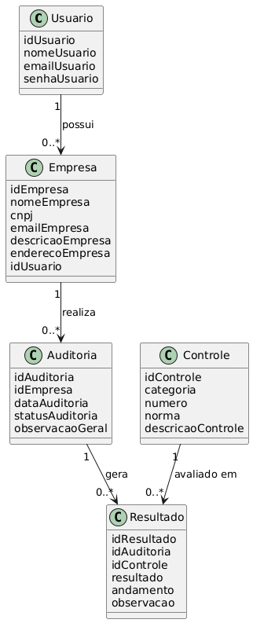

# 📊 Sistema de Auditoria de Empresas

## 🖥️ Sobre Nós

Esse projeto foi feito aplicando conceitos de Segurança da Informação, diagramas e organização de sistemas voltados para audiotoria de empresas.
O sistema de auditoria de empresa busca facilitar o gerenciamento de audiotorias, permitindo maior controlesobre empresa, controles avalaidos e resultados obtidos durante o processo de audiotoria.

---

## 👨‍🎓 Colaboradores

- Github: [FabioPYaug](https://github.com/FabioPYAug)
- Github: [Victtows](https://github.com/victtows)
- Github: [Otaviopax ](https://github.com/Otaviopax) 

  
---

## 📌 Sobre o Projeto

O **Sistema de Auditoria de Empresas** é uma aplicação desenvolvida com o objetivo de gerenciar processos de auditoria com base em normas de controle.

O sistema permite o cadastro de usuários, empresas e a realização de auditorias estruturadas, registrando resultados de conformidade e acompanhando o andamento das avaliações.

---

## 🎯 Objetivos

- Centralizar o gerenciamento de auditorias
- Garantir organização dos controles por norma
- Registrar resultados de conformidade
- Facilitar acompanhamento de auditorias realizadas

---

## ⚙️ Funcionalidades

- Cadastro de usuários
- Cadastro de empresas vinculadas ao usuário
- Criação de auditorias por empresa
- Gerenciamento de controles (normas)
- Registro de resultados (Conforme / Não conforme / Não aplicavel)
- Controle de andamento das auditorias
- Registro de observações

---

## 📐 Modelo do Sistema

### Entidades principais:

- Usuário
- Empresa
- Auditoria
- Controle
- Resultado

---

## 🗒️ Norma 27001

Estabelece requisitos para implementar, manter e melhorar um Sistema de Gestão de Segurança da Informação (SGSI), focando na proteção geral dos dados.

---

## 🗒️ Norma 27701

Usa a ISO 27001 como extensão introduzindo requisitos específicos para um Sistema de Gestão de Privacidade de Informação (SGPI), voltado exclusivamente para a proteção de dados pessoas.

---

## 👤 Diagrama de Caso de Uso

---

## 🧱 Diagrama UML

---

## 📊 Diagrama de classe

